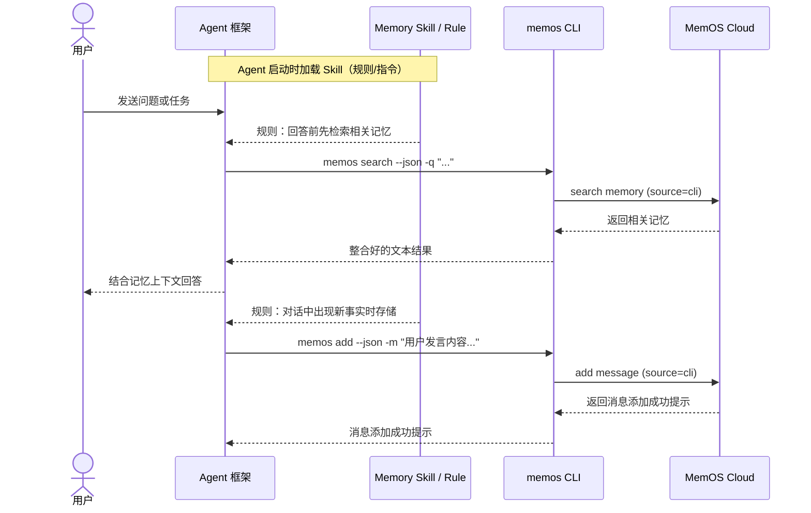

# MemOS CLI 需求清单

## 修订记录

| 时间 | 修订内容 |
| --- | --- |
| 5.6 | 初稿完成 |
| 5.6 | 补充了skill交付的相关内容 |

## 项目时间线

| **事项** | **说明** | **DDL** |
| --- | --- | --- |
| 需求确定 | 产品产出需求清单，和研发共同确认后定稿 | 5.6 |
| MVP 版本上线 | 核心接口能力、skill上线，官网完成文档更新 |  |
| 现有能力完善 | 非核心接口以外的高级能力接入 |  |

## 背景与目标

开发 CLI 工具的核心两个核心诉求：

*   天然适配各种 Agent 框架，实现跨框架记忆，开发后减少重复适配 Openclaw / Hermes 等不同生态工具的成本；
    
*   由于相比 MCP 来说，更节省 Token，是当下的一个值得追踪的热点（对用增有一定效果）。
    

本期需要实现的目标：

| 指标 | 目标口径 |
| --- | --- |
| 首次可用 | 开发者安装后顺利完成 `init -> add -> search -> get -> delete`。 |
| 框架适配 | 让任何能执行命令行的 Agent 框架，都能通过统一 CLI 接入 MemOS 云服务。 |
| 自动化接入 | 提供 Memory Skill 文件，让 Agent 框架实现"对话前自动检索、对话后自动存储"。 |
| 用户推广 | Dashboard 有快速开始入口，Doc 提供 Agent 接入示例。 |
| 来源追踪 | 表里能够识别请求来源为 cli，并且能够区分来自哪个框架（Openclaw / Hermes 等） |

## 用户流程

*   **开发者首次接入**
    
    ```mermaid
    flowchart LR
        entry["登录 Dashboard<br/>进入快速开始"] -->
        copy["选择 CLI<br/>复制安装与初始化代码块"]
        copy --> setup["安装 CLI<br/>执行 memos init"]
        setup --> smoke["跑通 add / search<br/>完成首次接入"]
        smoke --> human["终端继续使用<br/>文本输出"]
        smoke --> skillDoc["按文档配置<br/>Agent Memory Skill"]
        skillDoc --> automation["Agent 按 Skill 自动<br/>调用 CLI"]
    ```
    
*   **Agent 通过 Skill 自动调用流程**
    



## CLI vs Plugin vs MCP

|  | Plugin | CLI + Skill | MCP |
| --- | --- | --- | --- |
| 自动化程度 | 最高，强制 hook） | 中，Skill 驱动自动调用 | 低，依赖 Agent 自主决策 |
| 适配新框架成本 | 高，每个框架写一套 | 低，写一份 Skill 模板 | 中，需要 MCP 支持 |
| 覆盖面 | 仅已适配框架 | 所有能执行 shell 的框架 | 仅支持 MCP 的客户端 |
| Token 开销 | 最低，Plugin 内部处理） | 低，CLI 输出精简 | 较高，工具描述占上下文 |
| 开发者理解成本 | 安装即用 | 需理解 Skill 配置 | 需理解 MCP 协议 |

文档口径：**Plugin 是深度集成路径，CLI + Skill 是通用自动化路径，MCP 适合 MCP 原生客户端。三者互补，不是替代关系。**

## 需求清单与优先级

| 模块 | 功能清单 | 分工 |
| --- | --- | --- |
| CLI 安装与初始化 | P0<br>*   `memos init` 初始化<br>    <br>*   `memos config show` 查看当前配置<br>    <br>    P1<br>    <br>*   `memos config get/set` 读取/修改单个配置项 | *   研发负责代码更新 |
| 记忆操作命令 | P0核心接口：<br>*   `memos add`<br>    <br>*   `memos search`<br>    <br>*   `memos get`<br>    <br>*   `memos delete`<br>    <br>P1其余现有能力：<br>*   `memos kb`<br>    <br>*   `memos chat`<br>    <br>*   `memos extract/rerank`<br>    <br>*   `memos feedback`<br>    <br>*   ... | *   研发负责代码更新 |
| 全局输出参数 | P0<br>*   默认输出 text ，处理好的内容可以直接加到 agent 上下文；<br>    <br>*   `--json`<br>    <br>P1<br>*   `-o, --output`：支持更多输出格式<br>    <br>*   `--api-key` 覆盖本地配置中的 API Key<br>    <br>*   `--base-url` 覆盖本地配置中的 API Base URL | *   研发负责代码更新 |
| Agent Memory Skill | P0<br>*   提供通用 Memory Skill 模板<br>    <br>P1<br>*   Skill 模板支持配置项<br>    <br>*   Skill 效果评估与优化 |  |
| Dashboard 快速开始 | P0对应框架增加快速开始示例：安装 / 初始化 / add / search | *   研发确认命令、参数、示例可运行，参考[mem0](https://docs.mem0.ai/platform/cli)<br>    <br>*   产品负责文案与界面更新 |
| 文档与示例 | P0新增导航 、使用文档，与 OpenClaw / Cursor 插件 等架构互链 |
| 调用归因与指标 | P0`source=cli` 落库，并且能够区分来自哪个框架 | *   研发负责代码更新<br>    <br>*   产品验收 |